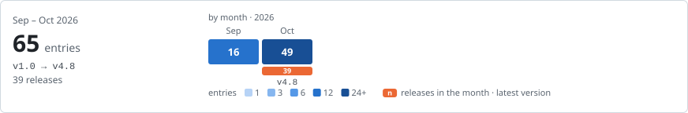

# DayWright

     

[Quick start](#quick-start) · [Architecture](#architecture) · [Change history](#change-history)

<!-- project-control:section=overview -->
## Overview

DayWright is a private, single-user, local-first multi-agent daily-life management workbench for goals, owned commitments, learning, life, work, and projects. Its central artifact is a user-approved plan grounded in actual daily records.

- Bounded Learning, Life, Work, Project, and Summary agents contribute assessments; the Orchestrator may propose today's plan or a change for approval. Summary-informed future tasks that an agent prepares are pencilled in with their evidence and wait until the user adds or dismisses them; they are not confirmed day plans.
- Everything stays on this Mac: its records, its Library, the search over it, and every model it runs. DayWright only looks a website up when you create a learning task from it, and again when that task starts, and keeps only its title, its own description and its headings.

The interface follows the Open Bench design: four places — Today (with Plans), Calendar, Goal, and Library — and Ava, the assistant, which is reachable from each of them. Agents pencil and the user sets: anything an agent proposes is dashed and names its agent until the user confirms it.

- A Guide, beside the language switch, says in a card what each part is for and the rule it keeps.

<!-- project-control:section=overview -->
## Capabilities

- **Today:** See the day at a glance, set your energy, report each task, catch up on several at once, pause the day, and let the Orchestrator propose plans from your own records.
- **Tasks and goals:** Set goals, record today's or future tasks, mark recurring commitments, and work in the Learn, Life, Work and Project areas, each one page of cards.
- **Plans:** Compare clearly different plans for the day side by side, set exactly one, deselect it, or ask for another; nothing is set without your confirmation.
- **Calendar and Summary:** Browse past and future months, inspect any day read-only, read the Summary agent's reports and suggestions for a day, a week, a month or all time, and see the patterns in the times you recorded.
- **Ava:** Ask about the plan, ask for a change, or report what happened, by typing or speaking; every change is a card you confirm, and Ava speaks up once a day when something needs attention.
- **Library and learning:** Keep what you study, notes, files, folders and websites, on this Mac, search them by meaning, link them to Learn tasks, and turn one into Learning tasks with a checklist.
- **Guide and languages:** Learn how each part works from the Guide's cards, and use the interface in English or Simplified Chinese.
- **Desktop app:** Open DayWright as a [Mac app](#desktop-app) that starts its own local service and stops it when you quit, with a menu bar line; the browser setup under [Quick start](#quick-start) remains for development.
- **Private by design:** Plans, conversation, proposals and decisions live in local SQLite storage, the existing local Qwen model answers through `llama-server`, and DayWright goes online only to look a learning task's website up.

<!-- project-control:section=ignore -->
### In detail

The rules each place keeps, as the [Guide](#guide-and-languages) states them in the app.

#### Today

- **The day strip:** See the day at a glance in Today's header, even before anything is recorded:
  - a 09:00–22:00 strip with its timed tasks, lunch and dinner, a mark at the time now with the time gone shaded, what is next, and how much of the day is left and still open.
- **Owned records:** See owned records, the next task, balance, and area links on Today, with how much of each day's tasks you fully finished over the last 7 days.
- **Plan and Summary tabs:** Beside the schedule, a Plan tab says which plan you are following, what it changed from your tasks and which agent finding led to each change, and a Summary agent tab reports on today.
  - Flexible tasks without a start time sit in the Untimed list under the schedule, in the order you made them.
- **Schedule rows:** Every schedule row, on Today, in Calendar and in Plans, shows its start time with its length below it.
- **Energy:** Say how your energy is, 1 to 5, in Today's header above Add task and Propose plans, as often as you like that day, or tell Ava ("energy 4", "I'm drained") and confirm her card.
  - Each reading is kept with its time, only for today, and the day's average is what plans, Ava, the area agents, Summary and Calendar use. A day nobody reports stays empty.
- **Statuses:** Only you mark a task Done, Partly done or Skipped, on Today, its sheet, the menu bar's panel (see [Desktop app](#desktop-app)) or through Ava, and DayWright keeps the time it took: every stretch it was current, from its planned start or from when it became current, added up.
  - Mark owned daily items and entries in the confirmed plan Planned, Done, Partly done, or Skipped; linked records and goal progress stay synchronized.
- **Time taken:** Without a status a task runs until its limit, twice its length, or 22:00; the next task's start or a meal interrupts it, and it resumes after, under its limit.
  - Rows and sheets show that time; one of twice the task's length or more, as at its limit, waits for you to confirm it.
  - A task stopped at its limit without a status says so on its row: Stopped at its limit · set its status.
- **Pause:** Pause the day on Today, in the menu bar's panel or through Ava ("pause my day", "I'm done for today"): nothing is current and no time counts, toward any task or limit, until you resume, or until 22:00.
  - Statuses can still be set while paused, and times stay as they were at the pause; the menu bar reads Paused since 14:10.
  - On Resume (Today, the panel, or "I'm back"), a timed task under way now comes first, else the task you paused, if it has no status and is under its limit, else the usual order. A timed task wholly inside the pause gets no time.
  - A day still paused at 22:00 reads its tasks without a status as Not done · paused, never no reply: Summary, graphs, estimates and Ava's cards keep them apart. The next day starts unpaused, and its notice says when you paused.
- **No reply:** A task still without a status at 22:00 reads Not done · no reply, and the next day Today lists yesterday's tasks to fix, with Catch up with Ava for her card of them; Ava also corrects a past task's time ("Review took 2 hours").
  - When the notice holds only times to check, Check times with Ava brings one card listing each, Right, or Change with the minutes it took.
- **Catch up:** Catch up on several tasks at once. Catch up on Today or Tasks lists every task today in time order, untimed ones last, each left as it is or set Done, Partly done or Skipped; one Save applies them all, with Undo for a few seconds.
  - In Ava's panel, Catch up or a sentence ("Did Review and Email, skipped Gym, half of Reading") brings one card of a day's tasks, today's or an earlier day's, applied on Confirm. A status a task had keeps its time, and one task's status never changes another's.
  - A Learning task left partly done with items unticked gets one Continue next session card. Carrying work forward never waits on a catch-up.
- **Lengths learned:** Area agents learn lengths from the time Done tasks took, a Partly done one only raising them; skipped and unanswered tasks are notes on their area and in Summary, never estimates.
  - When a length you set keeps differing from the time the task takes, its agent offers, through Ava, a card to change it on its days to come.
- **Suggestions:** Keep or dismiss a contextual suggestion.

#### Tasks and goals

- **Recording:** Set goals, record today's or future tasks, mark recurring commitments, and explicitly report progress. A fixed task has a start time, at any hour of the day; a flexible one has none until a plan you set places it, between 09:00 and 22:00.
  - A fixed task can't overlap another timed task that day: taken start times are greyed out with what takes them.
- **Lengths:** A length is optional: left blank, the task's area agent estimates it from your own records as soon as it is saved, then asks the local model unless the time the task took before gave it, and plans use the estimate, shown as ≈.
  - A length, given in the form or through Ava or estimated, is at least 30 minutes.
- **Dates and meals:** A task added to a day with plans proposed and none set is placed in them, from the form or through Ava. The date defaults to today. Lunch (12:00–13:00) and dinner (18:00–19:00) are kept free: a fixed task can't start where it would run into them.
  - Ava moves either, from today or a day you name on, or for one day, ending by midnight, and today's set plan is fitted around the new time or put up for review. A new user starts with an empty account, never an invented schedule.
- **Areas:** Create goal-linked or independent tasks directly in Learn, Life, Work, and Project.
  - Areas go by purpose, in order: Work when someone else expects it, Project for a step toward something you're building that has an end, Learn when the point is getting better at something, and Life for everything else; the task form lists each meaning.
  - A new task added without an area or goal of its own gets the area the Orchestrator suggests by that rule, by keywords for each purpose when one matches, else through the local model while it runs, and you can change it.
- **Goals:** Goals shows the linked work and overall completion progress, two goals to a row. Each goal shows the time it spans, from when you made it to that plus the length of every task in it, given or estimated;
  - editing a goal shows its steps done week by week against all of them, with the weeks ahead outlined to what is planned, and lists all its tasks, with Edit on a task today or later and Delete on a past one.
  - Every goal card is the same height and lists up to three tasks, with Show all for the rest. Pausing a goal pauses its tasks: plans skip them, and they can't be reported until the goal resumes.
- **Goal:** Open Goals, Tasks across dates, and the Learn, Life, Work, and Project areas from Goal, each on its own row. Each area is one page of cards, and its forms open in a sheet beside the page. Scheduled items still match the same day's records in Calendar.
  - Library notes and files are not calendar events.
- **Area pages:** Open an area as one page of cards, built from its tasks, goals and repeats, each card with its days, what it counts, its numbers and a small visual: in every area the day's tasks with the area's own strip, and its agent's notes for today,
  - including what suits a low- or high-energy day; Learn's subjects, with time done against planned, a practice row and the next session, and the week's practice bars; Life's habits with their rule and week grid, the day's shape with its free windows,
  - and the day's energy readings with seven days of averages; Work's load bars, the week's meetings and what carried over, which Ava can move; and each project's status, step bar, next steps and what was done lately. Each figure counts only tasks fully done.
  - Everything is added from one + Add at the top of the page: a task or a goal, and in Learn a note or file.
  - Every area adds its repeating tasks' planned against actual, from every time recorded. Learn adds Section pace, the time a checklist section takes by source, which a learning task uses to say what its sections left will take.
  - Life's Energy card adds one line on how energy changes how long tasks take.
- **Review and stalls:** A Learning goal with nothing fully done for 3 days is due for review and a Project goal stalls, which its area agent tells you through Ava once a day; a paused goal never does.
  - Past reports stay read-only, and are made again when one of their tasks is edited.

#### Plans

- **Proposing:** Explicitly ask the Orchestrator to propose clearly different same-date alternatives from today's items and eligible recurrence. Each plan keeps fixed times, places tasks without a start time between 09:00 and 22:00 after the current moment, and keeps lunch and dinner free, shown in its schedule.
- **The plans offered:** Balanced is always offered: the areas take turns by priority, work and project first, then life, then learning.
  - Beside it, each area agent votes for up to three plans that suit its own tasks, and the local model reads the day, from its tasks and their details to the agents' findings and votes, your energy and the plans you set most often, and picks two of Deep focus,
  - Lighter day, Finish early, Quick wins first, Easiest first, Your usual rhythm, and Breathing room, saying why; without the model, the votes decide, and DayWright's own ranking fills any place left. A day gets three plans whenever three different ones can be made.
- **Comparing:** Plans compares them side by side, or one at a time on a phone: each says in one line how it works, lists its first task, when the day ends, and the lengths it changed, says why it was suggested, and names what sets it apart.
  - Plans never shorten a length you set; an estimated length may be shortened, never below 15 minutes. Task names in a plan are always in quotation marks.
- **Agent reviews:** Before proposing, each area agent reviews its tasks for the day against all your records, kept as one profile per task:
  - a task often left partly done or skipped gets a shorter block when its length is an estimate, a task usually finished keeps its length, and a flexible task usually done at a steady time is placed near that time by Your usual rhythm.
  - Plans follow these findings, which Plans lists and Today's Plan tab cites beside each change. When today's energy averages 2 or below, the Life agent advises a lighter day and Lighter day is listed first; at 4 or above, Deep focus is.
  - Plans proposed by an earlier version get their agent list rebuilt by the current agents when DayWright starts.
- **Setting one:** Confirm exactly one plan for a date; replacing it requires a named, explicit approval. Today's set plan can also be deselected: the proposed plans stay, to compare and set one again, and the tasks keep what was reported for them.
  - Propose again rebuilds today's plans that aren't set from the tasks as they are now.
- **Agents told:** Every change to a task, a plan or a goal goes to the Orchestrator, which hands it to the area agent of the task's area and to Summary; those agents then look at today again, and Ava posts anything new that needs your attention.

#### Calendar and Summary

- **Calendar:** Browse past and future months in Calendar, see recorded-day month totals, select a day, and inspect its schedule and how its set plan was followed, with the Summary agent's reports and Patterns on two more tabs. Each day with energy reported shows a small five-step meter for its average.
  - A past day is read-only there. Unrecorded dates stay empty rather than receiving invented history.
- **Reports:** View saved Summary-agent reports and suggestions for a day, ISO week, or month, and in Calendar a report on all time, made fresh each time and holding no saved advice.
  - Each report is laid out as outcomes by area, graphs, what the area agents see (tasks that keep slipping, whose length looks off, or that go well), unfinished tasks, energy, and area records.
- **Energy in reports:** Energy shows the period's readings, its lowest and highest days and the change from the period before, and, from 5 reported days, how many tasks were fully done on low-energy days against the others.
- **Graphs:** A week or month adds three graphs with a bar per day: the time fully done by area, the share of tasks fully done, and how each set plan was followed; a day shows how its set plan was followed.
- **Patterns:** Calendar's third tab shows what your recorded times say over the 7 or 30 days to the day on show, or all time: Best hours, Energy and real time, Planned against actual, Estimates improving, Time by outcome and Reporting habit.
  - Each graph says what it found in one sentence. It waits for enough, such as 10 fully done tasks for Best hours or 3 days for most, and is still settling until twice that. Week draws a column a day, Month a week, All time a month.
  - Only recorded times count. A time to check, or one whose task stopped at its limit without a status, stays out until checked; a note counts them, Ask Ava lists the same on one card, and Catch up starts from the earliest needing a status.
  - Skipped and unanswered tasks count toward time spent, never toward estimates; paused time counts nowhere, and Not done · paused shows apart.
- **Graph tips:** Every graph, in Patterns, Summary and the area pages, shows a mark's words in a small tip on hover or a tap. Each graph is one tab stop: the arrow keys move between its marks, and Escape hides the tip.
- **Periods:** In Calendar, Week lists its days, Month its weeks and All time its months, newest first, each with its own outcomes and advice. Explicit named-task shortening requests inform later plans and traceable agent-prepared future tasks.
- **Repeat suggestions:** The current-week report can also suggest the next date of a repeat explicitly completed on at least two recorded days, its days linked whatever each is called:
  - tomorrow when its latest day repeats daily, that day's weekday when weekly, and none once a day stops it or while its goal is paused; shortening feedback takes precedence. A suggestion waits on Today and in Calendar until the user adds or dismisses it.
- **Saved advice:** Manage saved soft/strong Summary advice by period and area. An active idea is dispatched to its relevant agent, and size/timing advice can prioritize a gentler variation. Discarding an idea stops its dispatch across periods; a matching later report shows a notice only.
  - Clearing one exact week and area permanently requires typing its target, and cleared advice stays cleared.

#### Ava

- **One box:** Ask Ava, the assistant, about the plan, ask for a change, or report what happened, without choosing a mode: Ava works out which from the words and labels its reply Question, Change or Report.
  - A proposed change lists exactly what would change, stays pencilled, and applies only when the user confirms it. Naming a task and a time, such as "Move Review to 10:30", proposes moving it there, or to the nearest free time when that one is taken.
- **What Ava knows:** Ava answers from the day's tasks, its set and proposed plans with why each was suggested, the area agents' findings, goals with their progress, and the last 7 days, and suggests three questions for the place on show.
  - Open the route behind every reply and plan, Orchestrator → area agents → Summary, with each agent's one job under its name, and the Library passages a reply drew on. Persist agent contributions and their bounded read/write scopes with the conversation.
- **Adding through Ava:** Ask Ava to add a task ("Add Read chapter 4 tomorrow at 9 for 45 min to my Spanish goal") or start a goal, with its first tasks, and it shows a card with the day, start, length, repeat and goal,
  - or the suggested area you can change; nothing is added until you confirm, and the form's checks apply.
- **Another plan:** Ask Ava for a different plan, and it offers the one the area agents vote for among the day's other plans; an area your words name counts double, and asking for a lighter day offers Lighter day.
- **Attention:** Hear from Ava when something needs attention: when an area agent finds a task that keeps slipping or whose length looks off, a Learning goal due for review or a stalled project, or the Orchestrator finds that today's tasks won't fit the time left,
  - or fill most of it after you report low energy, Ava posts a message once that day, naming the agent. A red dot on Ava's button marks it until you open Ava.
- **Changing a task:** Ask Ava to change a task, and its area agent speaks up when its records disagree, such as a move far from when you usually do it or a length it was mostly left partly done at; the change stays ready to confirm.
  - When a change names no task, or several, Ava asks which one. A question about nothing in your day is answered by the Orchestrator alone.
- **Past days:** Correct, remove or move forward a task on a past day through Ava, the only way such a task changes besides Delete in its goal's task list:
  - name it and say what to change, its title, detail, area, goal, a status reported late or the time it took, or move it to today or a later day, where it can be placed again; on its past day a task keeps its start, length and timing.
  - Ava shows each change before and after, names what it left out, and nothing changes until you confirm. "Remove that task" or "change it" right after naming one means that task.
  - A past task its day's set plan scheduled can be removed or moved too, and the plan keeps its entry, marked Removed or Moved to its new day, out of the counts.
  - From a past day, a repeating task's change can reach that day alone or its repeat from today on too, and a repeat can start, stop or switch from today.
- **The window:** On desktop Ava is a window floating over the page, so the page never narrows: it opens in the bottom-right corner, or beside an open sheet, and can be moved, made taller or shorter from its top edge, or put back with a double-click.
  - A click anywhere outside it closes it. On a phone it opens as a sheet.
- **Speaking:** Speak to Ava: press the microphone beside the empty box, and the words appear in the box as you say them, transcribed on this Mac; press stop, read them over and send.
- **The Library in replies:** Ask Ava, who leans on the areas: Library passages only support facts and details. A reply that drew on the Library ends by naming the notes and files it used.
  - A task you name ranks first what it links, then what its goal's other tasks link; a goal you name, what its tasks link; then the rest.
- **Library links:** Ask Ava to link a Library item to a Learn task, or unlink one, and she shows it as a card. A Learn task made without one gets a card suggesting up to three matching items, once; a dismissed card never returns.

#### Library and learning

- **Notes:** Add private notes to the Library, chunk them locally, and index their embeddings in `sqlite-vec`. The Library is for studying: nothing in it has an area or a goal, and adding a note, a file, a folder or a website asks for neither.
  - Browse them all, and remove one in two steps.
- **Links:** A Learn task's details link it to several Library items, and unlink any; only Learn tasks link, and only to what is already in the Library.
  - A task made From a source keeps that item as Checklist from; unlinking it keeps the checklist, its ticks and its effort. The rest are references.
  - A Learn task that links anything stays in Learn: its form names what it uses and asks you to unlink it first.
  - A goal holds what its tasks link, which its sheet lists.
- **Folders:** Connect a folder anywhere on this Mac, picked in the Mac's own window or typed; DayWright only reads it.
  - Its Markdown, PDF and Word files are a tree to tick: hidden files and the history, node_modules and dist folders start unticked, and a file over 20 MB or 300 pages stays unticked with its reason. Each ticked file joins the Library, named by its first heading.
  - Each kept file is then checked in the background: whether it can be read, and on the local model, from its title, headings and opening, whether it looks like study material. A Refresh checks only new or changed files.
  - The folder shows its progress, then Ava's card counts them: Ready to study, Can't read, Doesn't look like study material. The last two start unticked; tick any back, and Confirm removes the rest from the Library, never from the folder.
  - Refresh, and opening DayWright, picks up new, changed and removed files. A file gone from its folder is marked Not found in the folder, with Locate and Remove from Library; a folder no longer where it was keeps everything, with Update location.
- **Websites:** Save a website by its address, with what it's about if you like. It is looked up when you make a learning task from it, and again when that task starts, and keeps its title, its own description and its headings, never its text.
- **Briefings:** Click any item's name, in the Library, a goal's sheet, an area's card, search results or From a source, for its briefing: what it is about, its first- and second-level headings, and the Learn tasks that use it, under their goals.
  - Where these are missing, Ava suggests them on the local model, or you write them; nothing is kept before Confirm, and each is marked as Ava's or yours.
  - A folder's file opens in its app, Markdown in Obsidian when it's installed, others as Open with sets, or on the folder's website; a website opens in your browser.
- **From a source:** Make Learning tasks From a source, in the task form or Learn's + Add → Task: tick a folder's files, a website or a Library item.
  - Each becomes one task, named by its first heading, all on one day or one a day from it, alone or in a Learning goal, new or not. Its effort, light, steady or deep, and its length come from its whole text, and you can change both.
  - Plans put deep tasks early and in focus, light ones in gaps, in a goal's order.
- **Checklists:** Tick a learning task's checklist as you go: its second-level headings, or its first-level ones below the title, each a checkbox; any Learning task can have one you make. Add, rename, remove and reorder items by dragging or with Alt+↑ and Alt+↓.
  - Every item ticked suggests Done, which only you mark; a partly done task offers Continue next session, a follow-up carrying the whole checklist and its ticks. A past day's checklist changes only through Ava.
- **Subjects:** Learning's Subjects show each goal's next task to study, Ava moves it to the day on show and says what you will learn today from the items still to do, and a goal's progress counts its tasks done.
  - A website is looked up again once as its task starts; a changed page updates the checklist, marking headings new or gone, and the estimate, never a length you set.
- **Files:** Choose a Markdown, text-based PDF, or Word `.docx` file in the Mac's own window for bounded local extraction and indexing; unsupported formats and scanned PDFs produce a clear message.
  - A file chosen there remembers where it is and opens there, or says Original not found with Locate; one uploaded from the browser keeps only its text. Changed files with the same name retain separate indexed versions.
- **Search:** Search your library by meaning, on this Mac: each passage shows its note or file and its part, and Ask Ava about this opens Ava with a question about it typed in. Items whose name, briefing or headings hold the words, websites among them, are listed first.
  - Search covers the whole Library. Learn's Library card lists what its tasks use first, then the newest.

#### Guide and languages

- **Languages:** Switch the interface between English and Simplified Chinese; the same preference tells the local Orchestrator which language to use for its response.
- **The Guide:** Learn how DayWright works from the Guide, opened beside EN/中文 and in English in either language:
  - fourteen cards in five sections, The day, Your work, Library, Ava and the agents, and Rules everywhere, each saying in three labelled lines what a part is For, what you Do there, and the Rule it keeps.
  - A small ? beside each screen's title opens that screen's cards in a sheet, and the ? beside Ava's name shows Ava's and the agents' cards in its place.
  - Ask Ava how something works, such as "How do meals work?", and it answers from the matching cards, changing nothing, and ends with See Guide links that open each card in the Guide.

#### Private by design

- **Storage:** Persist plans, conversation, proposals, and decisions in local SQLite storage.
- **The model:** Use the existing local Qwen model for Orchestrator synthesis through `llama-server`; no model copy is kept here. When it can't run, Today says what still works, which local parts are missing, and that nothing is sent elsewhere instead.

## Quick start

Requirements: Node.js 20 or newer, Python 3.12 or newer, and the model setup described under [Local models](#models) for model-backed conversation.

1. In a terminal, move into the `DayWright` folder. 2. Prepare the local service once:

   ```sh
   python3.12 -m venv .venv12
   .venv12/bin/pip install -r backend/requirements.txt
   ```

3. Start the local service:

   ```sh
   npm run api
   ```

4. In a second terminal, from the same `DayWright` folder, start the interface:

   ```sh
   npm run dev
   ```

5. Open the local address shown by the interface command. The title bar's status pill reads “Private on this Mac · Model on standby” until the first model-backed conversation starts the model, then “Model ready”.

For a populated walkthrough that cannot mix with personal records, start `npm run api:demo`, then start the interface with `DAYWRIGHT_API_TARGET=http://127.0.0.1:8423 npm run dev`. The demo uses `backend/data/daywright.demo.sqlite3`, shows a persistent demo banner, and contains sample goals, today tasks, domain records, and read-only historical plans.

- It intentionally starts before today's plan is generated, so the presenter can begin by selecting “Propose plans” on Today, compare the alternatives, and set one.

If an older local service and interface are already running, stop those two terminal commands and start them again to load this source revision. Refreshing an older preview alone may still show its previously loaded service routes.

**Success check:** A fresh account has no plan. Add a goal, a fixed task with a start time, and a flexible task without one for today, then select “Propose plans” on Today. Plans shows the available alternatives side by side; setting one updates Today, Calendar, Goals, and the areas.

- Calendar can move to a previous month without creating history, and day/week/month Summary-agent reports stay visible.

If the service is not running, the interface opens in an honest offline view. Nothing is sent, generated, or saved, and it does not simulate an agent answer.

### Desktop app

`DayWright.app` runs the same interface and local service without a terminal, on macOS 15 or later. Open it like any Mac app: a start screen shows while its service starts, then Today opens. DayWright's own title bar holds the window buttons, and links to web pages open in your browser.

- The window opens at, and can't be made smaller than, 1412 × 938 points. Closing it keeps DayWright in the menu bar; the Dock or the menu bar brings it back. Quitting, from the menu bar or the app menu, stops the service and any model it started.

- **Menu bar:** one line, renewed each minute: the task now, the time it has taken over its set time, and the next task ("Review · 32 / 60 min · next: Email Anna"), in the interface's language; while the day is paused, Paused since 14:10.
  - A click opens a small panel with both tasks, a status control for each, Pause or Resume, and Open DayWright; its menu opens the window or quits. It never notifies.

- **Your records:** kept in `~/Library/Application Support/DayWright/`, apart from the development database in `backend/data/`. The app starts with an empty account.
- **Models:** the same shared library and `llama-server` as [Local models](#models). macOS asks once for access to the Documents folder, where the models live, and may ask again after a rebuild, because the app is signed on this Mac rather than with an Apple developer ID.
- **If it doesn't start:** the start screen says so, and the reason is in `~/Library/Logs/DayWright/service.log`, which each launch begins afresh.

### Build from source

To build it you also need Rust (stable, through rustup) and Xcode's command-line tools. From the `DayWright` folder:

```sh
npm install
npm run desktop
```

The first build downloads the service's Python packages into `build/desktop-venv` and Tauri's Rust crates; later builds reuse them. The app is written to `src-tauri/target/release/bundle/macos/DayWright.app`. Keep the copy you use at `DayWright.app` in this folder, which Git ignores, or wherever you keep your apps.

<!-- project-control:section=workflows -->
## Workflow

```text
Open Today
set goals and record your actual daily items
  ↓
ask the Orchestrator to propose from owned/eligible recurring items
  ↓
each plan places tasks without a start time in free time, its own way
  ↓
compare the proposed plans side by side in Plans
  ↓
set one plan for the day
  ↓
report Done / Partly done / Skipped on today's owned items/current plan
  ↓
review day/week/month Summary-agent advice and explicit preference evidence
  ↓
inspect past plans as read-only snapshots; preset future commitments now
  ↓
add or dismiss agent-prepared future tasks, each showing its Summary evidence
  ↓
explicitly review a replacement if another plan becomes preferable

Ask or mark up the plan
embed the question with Qwen3 Embedding 0.6B
  ↓
retrieve the nearest Library passages from sqlite-vec, those a named task or goal links first
  ↓
Orchestrator routes the request
  ↓
Learning / Life / Work / Project review their tasks against all your records
  ↓
Summary sums up what they found
  ↓
the Orchestrator answers as Ava through the shared local Qwen runtime
  ↓
structured proposal appears
  ↓
user confirms or dismisses it

Ask how something works
name a part of DayWright, such as "How do meals work?"
  ↓
Ava answers from the matching Guide cards, without the model or the agents
  ↓
See Guide links open each card in the Guide

Pause the day
press Pause on Today or in the menu bar, or ask Ava
  ↓
nothing is current and no time counts until you resume
  ↓
Resume picks the timed task under way, else the task you paused
  ↓
still paused at 22:00: tasks without a status read Not done · paused

Connect a study folder
tick the folder's files to keep in the Library
  ↓
each kept file is checked in the background: can it be read, does it look like study material
  ↓
Ava posts one card: Ready to study · Can't read · Doesn't look like study material
  ↓
tick back any file to keep, then confirm or dismiss
```

A plan proposal does not set or replace a plan by itself, and a Summary-informed future task is prepared with its provenance but stays pencilled until the user adds it. The SQLite record, not conversational wording, is the source of truth.

For a selected local file, DayWright accepts at most 2 MB, 20 PDF pages, and 50,000 extracted characters. Only readable text is indexed; a scanned or encrypted PDF needs preparation first.

- Everything stays on this Mac; DayWright only looks a website up when you create a learning task from it, and again when that task starts.
- The Library holds what you write, import, connect or save, the search over it runs on this Mac, and Ava reads its passages after the area and day context, as references for facts and details; the advice comes from the agents' reports and your tasks, goals and plans.

<!-- project-control:section=architecture -->
## Architecture

### AI & Intelligence

| Technology or concept | Use in this project |
|---|---|
| Multi-agent core | PlatformState day-proposal graph with a separate SQLite checkpoint file, the area agents' all-time reviews, votes and issues, Summary's sum-up, and the Orchestrator's one run that proposes |
| Deterministic planner | Valid record-based alternatives, each placing tasks without a start time in free time around fixed ones; repeated named-task evidence, the area agents' findings on length and usual time, duration arithmetic, and lengths you set, which no plan shortens |
| LangGraph | Holds the PlatformState day-proposal graph, checkpointed through `langgraph-checkpoint-sqlite` into `daywright.checkpoints.sqlite3`, a separate file from the record database; conversation routing is not yet a complete main graph. |
| Retrieval-Augmented Generation (RAG) | A question is embedded with a retrieval instruction, the nearest Library passages are selected from `sqlite-vec` under a distance threshold, and the chat model receives the question plus those passages, never raw vectors. |
| Shared `LlamaRuntime` supervisor | Authenticated loopback process startup, health readiness, concurrent first-use serialization, failure recovery, and shutdown |
| ModelGateway | Local chat-model response contract over the shared runtime supervisor |
| EmbeddingGateway | Separate embedding-only contract for indexing and question retrieval over the shared supervisor |
| SpeechGateway | Short, user-initiated local WAV transcription through a converted Whisper-small model; temporary audio is removed after the request |
| Qwen3-4B Q4_K_M | The shared conversation model, `gguf/Qwen3-4B-Q4_K_M.gguf` in the Mac's AI-Models library, served by `llama-server` for Ava's replies and the choice among proposed plans. |
| Qwen3-Embedding-0.6B Q8_0 | The shared embedding model, served by a second embedding-only `llama-server`, producing the 1,024-dimensional vectors the Library search stores. |
| faster-whisper | CPU inference over the converted Whisper-small model in the shared library for push-to-talk transcription; the audio is discarded after recognition. |

### Frontend & Presentation

| Technology or concept | Use in this project |
|---|---|
| React interface | Open Bench places — Today with Plans, Calendar, Goal (Goals, Tasks, and the four areas), and Library — with Ava floating over each of them, and the Guide beside the language switch |
| Desktop shell (Tauri) | One window with DayWright's title bar, and a menu bar item with its panel; starts the bundled service with a new secret for each launch, shows the interface once the service answers, sends other web addresses to the browser, and stops the service on quit |
| Vite | Serves the interface for `npm run dev` and builds it for the desktop app and the packaging check. |
| Bricolage Grotesque and Figtree | The Open Bench typefaces, shipped with the app through the Fontsource packages so nothing is fetched at run time. |
| English and Simplified Chinese | Every interface string comes from `src/i18n.jsx` in both languages, switched beside the Guide; the same choice sets the language Ava answers in. |

### Backend & Application Logic

| Technology or concept | Use in this project |
|---|---|
| FastAPI service | Local API, validation, conversation policy, and model lifecycle |
| Desktop service entry | The service frozen into the app: serves the interface and API from one loopback address (port 8425 when free), answers only the app's window, exits with the app, and stops model servers a crash left behind |
| Python 3.12 and uvicorn | Run the service, `backend/app/main.py`, on a loopback port for development; the desktop app runs the same service frozen. |
| httpx | The one outbound client: it looks a website up when a learning task is made from it, and again as that task starts. |

### Data & Storage

| Technology or concept | Use in this project |
|---|---|
| SQLite repository | Goals, owned items, plan snapshots, reports, the area agents' task profiles, explicit feedback, conversations, Ava's messages, decisions, the Library's sources, the Learn tasks' links to them, each folder file's check, each day's pauses, and retrieval provenance |
| `sqlite-vec` index | Local 1,024-dimensional nearest-neighbor search beside the authoritative records |
| pypdf and python-docx | Extract the text of a selected PDF or Word file for the Library, within the size and page limits the Workflow states. |
| Local folders | Development data lives in `backend/data/`, which Git ignores; the desktop app keeps its records in `~/Library/Application Support/DayWright/` and its log in `~/Library/Logs/DayWright/`. |

### Integrations & Security

| Technology or concept | Use in this project |
|---|---|
| Loopback-only service | The service, the interface and both model runtimes bind only to loopback; the desktop shell starts its service with a new secret for each launch, and a model process carries a per-launch token. |
| Website lookup | The only network use: a website is fetched when a learning task is created from it and once more as the task starts; web search, remote AI and other lookups are absent. |
| macOS permissions | The app asks once for the Documents folder, where the shared models live, and once for the microphone; it is signed on the Mac that builds it. |

### Build & Delivery

| Technology or concept | Use in this project |
|---|---|
| Tauri CLI and Rust | `npm run desktop` builds the interface, freezes the service and bundles `DayWright.app` with Tauri 2, whose tray feature gives the menu bar item. |
| PyInstaller | `scripts/build-desktop-service.sh` freezes the service into `build/service/daywright-service` from `backend/requirements-desktop.txt`, with `sqlite-vec`, the voice-activity model, the Guide and the wording file collected. |
| Tests | `npm test` builds the interface, checks the packaging contract, runs the interface helper suites under `tests/` with `node --test`, and runs the backend `unittest` suites on a temporary database. |
| Static packaging contract | `worker/`, `.openai/hosting.json` and `scripts/prepare-sites-build.mjs` keep the earlier prototype's packaging contract; no hosted deployment is claimed. |

The service is loopback-only, in the documented development command and in the desktop app. Generated private data and `daywright.checkpoints.sqlite3` live in `backend/data/`, which Git ignores, or in the desktop app's Application Support folder. Checkpoints are execution snapshots; the main database remains the authority for confirmed plans and the Library.

## Project structure

| Path | Contents |
|---|---|
| `src/` | React interface organized by place (`today/`, `plans/`, `calendar/`, `patterns/`, `records/`, `library/`, `talk/`), with the shell in `shell/`, shared controls in `ui/`, the menu bar's panel in `menubar/`, the Guide and its cards (`guide/guide.json`, which Ava's service also reads) in `guide/`, and the Open Bench styles in `bench.css` |
| `design/` | Open Bench handoff: the interface specification, colour and type tokens, and icons |
| `backend/app/` | Local service, multi-agent core, SQLite/`sqlite-vec` storage, planner, retrieval, and model gateways |
| `backend/tests/` | Planner, API, database-migration, and desktop-service behavior checks, kept off local data by `isolation.py` |
| `src-tauri/` | Desktop shell: the window, the menu bar item, service supervision, app icons, and bundle settings |
| `splash.html`, `src/desktop/` | The desktop app's start screen |
| `scripts/build-desktop-service.sh`, `backend/desktop_service.py`, `backend/requirements-desktop.txt` | Freezing the local service for the desktop app |
| `docs/Original Product Design.md` | Full original 767-line product design text retained as the detailed architecture source |
| `docs/DayWright — Product Design.md` | Revised product, UX, data, AI, privacy, and delivery specification |
| `docs/design-reference.png` | Approved visual source used for implementation and QA |
| `worker/`, `.openai/`, `scripts/prepare-sites-build.mjs` | Preserved local prototype packaging contract; no hosted deployment is claimed |
| `tests/` | The interface helper suites, one `node --test` file per area of behaviour, run by `npm test`. |
| `public/`, `index.html`, `vite.config.mjs` | The favicon, the page Vite serves and builds, and the Vite configuration. |
| `Resources/` | The 1,024-pixel project icon master, from which the favicon and the app icons are drawn. |
| `CONTRIBUTING.md` | Contribution and numbering rules for the public mirror. |
| `CHANGELOG.md` | The complete change history. |
| `CHANGELOG.svg` | The history strip drawn from the changelog. |

<!-- project-control:section=models -->
## Models

**Shared model storage:** DayWright uses the shared **AI-Models library in the Mac's Documents folder**, rather than maintaining separate project-owned model copies.

| Capability | Library-relative path | Connection |
|---|---|---|
| Conversation | `gguf/Qwen3-4B-Q4_K_M.gguf` | Loaded directly by the installed `llama-server` on first use |
| Semantic retrieval | `gguf/Qwen3-Embedding-0.6B-Q8_0.gguf` | Loaded by a separate embedding-only `llama-server` when indexing or retrieval begins |
| Voice transcription | `whisper/faster-whisper-small/` | Browser WAV capture and local `faster-whisper` CPU inference; original Core ML model remains untouched |

For a new local setup, after installing `backend/requirements.txt`, download the converted multilingual small model once from the [publisher's model repository](https://huggingface.co/Systran/faster-whisper-small) into the default shared library:

```sh
.venv12/bin/python -c 'from pathlib import Path; from faster_whisper.utils import download_model; download_model("small", output_dir=str(Path.home() / "Documents/AI-Models/whisper/faster-whisper-small"))'
```

The local service uses only this saved path for transcription; it does not fetch a model when a user presses the microphone. Listening begins only when the microphone beside Ava's empty box is pressed; the Mac app asks once for microphone access.

- While the user speaks, the words so far are transcribed every 1.5 seconds and shown in the box; stop transcribes the whole clip, up to 30 seconds, and leaves it in the box to read over and send, and Escape discards it. The audio is discarded after recognition.

The service expands the shared library from the current macOS home folder. Override only for a deliberate alternate setup:

```sh
DAYWRIGHT_MODEL_LIBRARY=/absolute/path/to/AI-Models npm run api
```

The chat and embedding runtimes use separate `llama-server` processes because they serve different model contracts, while one shared supervisor owns their duplicated process lifecycle.

- It serializes concurrent first-use requests until the relevant health check succeeds, binds a dynamically selected loopback port, supplies a random per-launch token through the child process environment, disables the web interface and request logs, runs offline on the CPU-safe backend, and stops each process with the DayWright service.
- A failed launch returns the existing rule-based or unavailable state instead of crashing the API. The app continues to plan and persist data if either model cannot start.

The embedding model produces 1,024-dimensional normalized vectors. DayWright stores those vectors in a `vec0` virtual table inside the same local SQLite database as the source text and metadata. Documents are currently chunked into 180-word windows with a 30-word overlap.

- A question is embedded with a retrieval instruction, nearest chunks are selected, and the chat model receives the original question plus those passages. Raw embedding arrays are never placed in the chat prompt.
- An explicit distance threshold prevents an unrelated nearest neighbor from being treated as useful evidence merely because it is the closest item in a small library.

Each agent has one job. Each area agent reviews its own tasks for the day against all your records, and its own records, deterministically.

- It reads them from one profile per task, kept in the same SQLite database and rebuilt from every record when DayWright starts and after each change, so history never needs a second store; an agent reads only its own area's profiles.
- The planner applies its findings and the interface shows them, for plans and for Ava's replies alike. Each area agent also votes for up to three plans that suit its own tasks, and reports to the Orchestrator what needs your attention.
- Summary sums up what was recorded, with how each area agent sees its tasks: the day in a route, and each day, week, month or all time in its reports, the wider ones broken down by day, week or month.
- The Orchestrator routes each request to the area agents it concerns, or answers alone a question about nothing in your day, hands a change to its task's own agent for any doubt, weighs their reviews, votes and Summary's sum-up, and alone decides:
- it builds the plans, which needs no chat model, has Qwen choose among them with the votes, answers as Ava with Qwen once per reply, and has Ava post each issue once a day. This preserves meaningful agent boundaries without loading the same 2.5 GB model six times.

The existing Qwen3 4B model passed the current cross-domain workload, so no additional model was downloaded or copied into the project. A larger replacement should be considered only after a repeatable quality benchmark shows that its improvement outweighs local memory and response-time costs.

## Limits

- The desktop app is signed only on the Mac that builds it: it has no Apple developer ID or notarization, no installer, and no automatic updates. Replies are not streamed and a running request cannot be cancelled.
- The Library reads written notes, Markdown, PDF and Word files, imported or in a connected folder, and a saved website's title, description and headings; other file types, scanned PDFs and a website's text stay out.
  - Voice capture, the local transcription endpoint, the installed `faster-whisper` runtime, and converted Whisper-small inference have been exercised through the real API with synthetic speech, and the words shown while speaking with a simulated microphone and transcriber; no user microphone recording was made during those checks.
- A folder's study check reads only a file's title, headings and first 120 words, so it can misjudge; it only unticks, and you decide on Ava's card. Without the local model, only whether each file can be read is checked.
- Goal-linked today/future records, daily/weekly carry-forward, and traceable agent-origin future commitments exist. Every area keeps tasks, goals and repeats only, and its page reads them; mastery/review workflows still remain.
- A plan places tasks without a start time between 09:00 and 22:00, never before the moment it is proposed, and keeps lunch and dinner free (12:00–13:00 and 18:00–19:00 unless moved through Ava); a meal a fixed task already takes is left out.
  - When today's free time can't hold them all, it says so rather than leaving one out.
- Summary now uses goals, plan outcomes, repeats, the time tasks took, tasks left without a status, the energy you report, the Library's counts, and exact-title shortening requests. It does not yet reason over all Library text or every conversational nuance.
  - Its current-period reports run on demand and saved past reports freeze after the period ends; full summary-to-plan provenance and semantic suggestion-similarity detection remain. Matching repeats are presently based on exact normalized domain/content, not a semantic model.
- Day proposals use a LangGraph state with a separate SQLite checkpoint file, to avoid concurrent checkpoint writes in the `sqlite-vec` database, while conversation routing has not joined a complete main graph; the original architecture is not claimed fully implemented. Checkpoint retention controls are not yet present.
- DayWright goes online only to look a website up when a learning task is made from it, and once more as that task starts: web search, other public lookups, following links, MCP providers, finance providers, and remote AI are intentionally absent.
- A note, or a file uploaded from the browser or imported before v4.6, keeps only its text, so it has nothing to open in an app. A folder's website opens each file's own page only for the Learning Atlas Observatory site, and its main address otherwise.
- A checklist comes from headings only: a source with no second-level headings, and no first-level ones below its title, gives a task without one until headings are added or you make your own. An untimed task's website is looked up again when its briefing is first opened on its day.
- Ava proposes plans and replacements for them, moves, lengths, meal times, corrections to past tasks and the time they took, a day's statuses at once, repeats started, stopped or switched, and new tasks and goals, each on a card you confirm.
  - She also brings yesterday's times to check, or every time Patterns leaves out for the days it shows, and pauses or resumes today, each on a card too.
  - The design's schedule preview of a pending change is not built. Several things are recorded at once only as statuses, through Catch up on Today or Tasks or Ava's catch-up card.
- A task's time taken comes from the schedule and when you set statuses, not from a timer: every stretch it was current adds up, a task interrupted by a scheduled task or a meal resumes after, and without a status it stops at twice its length or 22:00.
  - Nothing counts while the day is paused.
  - A status set after a task stopped, or changed later, keeps the time it had. Ava corrects the time of a past day's task; today's comes from when you set each status.
  - The menu bar and the next-day notice never alert or count down.
- Patterns read only the times kept since v4.7 and the energy you report, describe what was recorded rather than advise, and are not yet read by Ava or the agents.
- Local storage is not yet encrypted and the user-facing backup/export/delete controls required for production are not built.

## Maintenance

### Run the checks

Run the implementation checks from the `DayWright` folder:

```sh
npm test
```

This builds the interface, checks the static packaging contract, exercises the interface's date, plan-comparison, task, learning-task, time-taken, catch-up, menu bar, Library, Guide, and Ava helpers, and exercises the local planner, the time rules, catching up and its undo, the API, and the desktop service's session check, port choice,

- and model-process cleanup. The backend tests run on a temporary database and fail if any of them reaches `backend/data/`, so they never touch local records; they connect only throwaway folders, and every website lookup is replaced.
- Model loading is checked separately because it uses the 2.5 GB shared model at runtime. `npm run desktop` builds the [desktop app](#desktop-app).

<!-- project-control:section=release -->
## Current release

**v5.1 (build 51)** in source and in a signed local build, not yet installed; About DayWright, in the app menu, shows it as Version 5.1.0 (51). [Change and delivery evidence](CHANGELOG.md#v5-1-build-51).

## References

### Design source

The current interface follows the [Open Bench handoff](design/HANDOFF.md), with its tokens in `design/tokens/` and its icons in `design/icons/`.

The [original product design](docs/Original%20Product%20Design.md) retains the detailed component contract. The [revised product design specification](docs/DayWright%20%E2%80%94%20Product%20Design.md) defines product scope, confirmation rules, state ownership, local-model policy, privacy requirements, and staged delivery. The approved visual reference at `docs/design-reference.png` established the first slice’s palette, typographic hierarchy, and editorial materials.

- The specification's [fidelity ledger](docs/DayWright%20%E2%80%94%20Product%20Design.md#19-original-design-contract-and-fidelity-ledger) maps the original platform contract to present source and remaining work.

<!-- project-control:section=ignore -->
## Contributing

For source changes, follow the [DayWright contribution guide](CONTRIBUTING.md).

<!-- project-control:section=history -->
## Change history



**Change-history numbering:** This project uses marketing versions and integer build numbers, from
v1.0 build 10; earlier records are dated. Follow the [version and build policy](CONTRIBUTING.md#version-and-build-policy).

One record per change; complete details and evidence are in [CHANGELOG.md](CHANGELOG.md). Older work dates and Git checkpoints remain labelled when they differ.

**Historical status:** Each record describes its own delivery checkpoint. Later records supersede older pending work or recovery locations; historical checks are not new validation.

| Record | Date | Highlights | Details |
|---|---|---|---|
| v5.1 / build 51 | 2026-10-08 | <ul><li><strong>Patterns:</strong> Calendar's third tab shows what your recorded times say over 7 or 30 days or all time: best hours, energy and real time, planned against actual, estimates, time by outcome and reporting habit, each with its finding.</li><li><strong>Elsewhere:</strong> Area pages list their repeating tasks' planned against actual; Learn shows section pace, which a learning task uses for its sections left; Life's Energy card says how energy changes task times.</li><li><strong>Tips:</strong> Every graph, new and existing, shows each mark's words in a tip on hover, a tap or the arrow keys, one tab stop a graph.</li></ul> | [Full record](CHANGELOG.md#v5-1-build-51) |
| v5.0 / build 50 | 2026-10-08 | <ul><li><strong>Pause:</strong> Pause the day on Today, in the menu bar's panel or through Ava: nothing is current and no time counts until you resume; Resume picks a timed task under way, else the task you paused.</li><li><strong>Not done · paused:</strong> A day still paused at 22:00 reads its tasks without a status as Not done · paused, kept apart from no reply in Summary, graphs and estimates; the next day's notice says when you paused.</li><li><strong>Limits and times:</strong> On Today, a task stopped at its limit without a status says so on its row; when yesterday's notice holds only times to check, Check times with Ava brings one card, Right or Change for each.</li></ul> | [Full record](CHANGELOG.md#v5-0-build-50) |
| v4.9 / build 49 | 2026-10-07 | <ul><li><strong>Library:</strong> For studying only: notes, files, folders and websites, with no area or goal. Moving to v4.9 removes Life, Work and Project items and folders from it, never a file on disk.</li><li><strong>Links:</strong> A Learn task's details link several Library items and unlink any, its checklist's own too; a Learn task that uses any stays in Learn. Ava links on a card, and suggests up to three for a new Learn task.</li><li><strong>Folder check:</strong> A connected folder's new or changed files are checked: can each be read, and does it look like study material. Ava's card leaves the rest unticked; Confirm removes them from the Library only.</li><li><strong>Briefings:</strong> An item's briefing lists the tasks that use it, under their goals; Ava looks first in what a named task links, then in what its goal's other tasks link.</li></ul> | [Full record](CHANGELOG.md#v4-9-build-49) |
| Documentation | 2026-10-07 | <ul><li><strong>Documentation:</strong> Lines in the README and the contribution guide that v4.5–v4.8 had left behind now match the app: time taken adds up every stretch, the Library reads folders and websites, the Guide has fourteen cards, and statuses read Partly done.</li></ul> | [Full record](CHANGELOG.md#readme-and-guide-up-to-date) |
| Maintenance | 2026-10-07 | <ul><li><strong>Maintenance:</strong> The design QA notes and four screenshots of the folio interface, from 14–15 September, left the project; Open Bench has replaced every screen they show.</li></ul> | [Full record](CHANGELOG.md#old-design-qa-removed) |
| Documentation | 2026-10-07 | <ul><li><strong>Documentation:</strong> The rules behind the Capabilities map moved from Usage into Capabilities itself, under one In detail subsection with a heading per map item; Project Control still shows the map alone.</li></ul> | [Full record](CHANGELOG.md#capabilities-in-one-section) |
| Documentation | 2026-10-07 | <ul><li><strong>Documentation:</strong> Capabilities is a map of nine labelled lines, one per place; every rule moved under a new Usage section with one labelled list per place, word for word.</li></ul> | [Full record](CHANGELOG.md#capabilities-as-a-map) |
| Documentation | 2026-10-07 | <ul><li><strong>Documentation:</strong> The README follows the shared form: the skeleton's sections, a badge row and three quick links, every block within fifty words, architecture tables by category, and the complete history in <code>CHANGELOG.md</code> with its strip under Change history.</li></ul> | [Full record](CHANGELOG.md#readme-in-the-shared-form) |
| v4.8 / build 48 | 2026-10-06 | <ul><li><strong>Catch up:</strong> On Today and Tasks, one sheet of every task today, each left as it is or set Done, Partly done or Skipped; one Save applies all, with Undo for a few seconds.</li><li><strong>Ava:</strong> Catch up, or a sentence such as "Did Review and Email, skipped Gym, half of Reading", brings one card of the day's tasks, applied on Confirm; yesterday's notice opens it for yesterday.</li><li><strong>Learning:</strong> A partly done Learning task with items left gets one Continue next session card.</li><li><strong>Time taken:</strong> Every task stops at twice its length without a status; one interrupted resumes after, and its time adds up every stretch.</li></ul> | [Full record](CHANGELOG.md#v4-8-build-48) |
| v4.7 / build 47 | 2026-10-06 | <ul><li><strong>Menu bar:</strong> The task now, its time taken over its set time, and the next, renewed each minute; a click opens a panel to report either; closing the window keeps DayWright there.</li><li><strong>Time taken:</strong> Kept for every status, from a task's start to when you set it, stopping at the next task, a meal or 22:00; rows and sheets show it.</li><li><strong>No reply:</strong> At 22:00 a task with no status reads Not done · no reply, and the next day Today lists what to fix through Ava, who corrects past times too.</li><li><strong>Agents:</strong> Lengths come from the time Done tasks took; skipped and unanswered tasks are signals; a set length that keeps differing gets a card to change it.</li></ul> | [Full record](CHANGELOG.md#v4-7-build-47) |

---

---

<!-- project-control:section=ignore -->
## 🔒 License

**PROPRIETARY SOFTWARE — ALL RIGHTS RESERVED**

Copyright © 2024–2026 Soucieux. All rights reserved.

The original source code, documentation, and other original materials in this repository are proprietary and are not open-source software.

Except where applicable law expressly permits otherwise, no permission is granted to copy, modify, publish, distribute, sublicense, sell, deploy, or create derivative works from these materials, in whole or in part, without prior written authorization from the copyright owner.

Access to this repository does not grant a license. Third-party software and materials remain subject to their respective license terms.

*This private project is not open for external contributions.*
